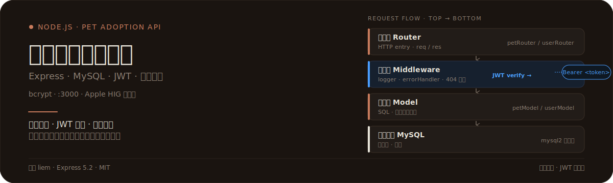
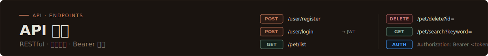

<p align="center">
  
</p>

# 宠物领养管理系统

为宠物领养业务提供温暖可靠的后端服务:基于 **Node.js + Express + MySQL + JWT** 的分层架构后端 API,集成用户注册登录、宠物信息管理、关键字搜索,并附带一个 Apple HIG + Liquid Glass 风格的 API 测试页面。

---

## 证明 · 真实接口与文件清单

### 接口表(真实路由)

| 方法 | 路径 | 鉴权 | 说明 |
| :--- | :--- | :---: | :--- |
| `POST` | `/user/register` | 否 | 用户注册(bcrypt 加密入库) |
| `POST` | `/user/login` | 否 | 用户登录,返回 JWT(有效期 24h) |
| `GET` | `/user/info` | 是 | 获取当前登录用户信息 |
| `POST` | `/pet/add` | 是 | 新增宠物信息 |
| `GET` | `/pet/list` | 否 | 查询宠物列表(按时间倒序) |
| `GET` | `/pet/search?keyword=` | 否 | 关键字搜索(名称/分类模糊匹配) |
| `DELETE` | `/pet/delete?id=` | 是 | 删除指定宠物 |

### 文件清单(真实项目结构)

```
pet-adoption-system/
├── config/
│   └── db.config.js          # MySQL 连接池配置
├── db/
│   ├── index.js              # 数据库初始化入口
│   └── init.sql              # 建表与初始数据脚本
├── middleware/
│   ├── auth.js               # JWT 鉴权中间件
│   ├── errorHandler.js       # 全局错误处理
│   └── logger.js             # 统一日志中间件
├── models/
│   ├── petModel.js           # 宠物数据模型
│   └── userModel.js          # 用户数据模型
├── public/
│   └── index.html            # Apple HIG + Liquid Glass API 测试页
├── router/
│   ├── petRouter.js          # 宠物路由
│   └── userRouter.js         # 用户路由
├── .env.example              # 环境变量示例
├── .gitignore
├── app.js                    # 应用入口(中间件装配)
└── package.json              # 依赖与脚本
```

---

## 这是什么

一套面向宠物领养场景的后端 API 系统:用分层架构组织代码,用 JWT 保护需要鉴权的接口,用 MySQL 持久化业务数据,前端附带一个可视化测试页面方便联调。

---

## 为什么不同

- **分层架构,职责清晰**:路由层只做 HTTP 入口,中间件层负责鉴权与日志,模型层封装 SQL,数据库层负责连接池。请求自上而下贯穿四层,每层只关心自己的事。
- **JWT 鉴权,状态可校验**:登录返回 24h 有效期的 JWT,受保护接口通过 `Authorization: Bearer <token>` 校验,中间件层统一拦截,无需在每个路由里重复判断。
- **bcrypt 密码加密**:用户密码以 hash 形式入库,数据库泄露也无法还原明文。
- **统一响应与错误兜底**:所有接口返回 `{ code, message, data }` 三段式结构;全局错误处理器、404 兜底、未捕获异常兜底三层保障,服务不会因单点异常崩溃。
- **Liquid Glass 测试页**:`public/index.html` 是一个基于 Apple HIG + Liquid Glass 风格设计的 API 测试页面,支持 Token 管理、密码可见性切换、Toast 反馈,开箱即用。

---

## 工作原理

请求从进入系统到返回响应的完整流程:

```
HTTP 请求
   │
   ▼
┌─────────────────────────────────────┐
│ 路由层 Router                        │  petRouter / userRouter
│ HTTP 入口,解析 req,组装 res          │
└─────────────────────────────────────┘
   │
   ▼
┌─────────────────────────────────────┐
│ 中间件 Middleware                    │  logger → auth(JWT verify)
│ 统一日志 / JWT 校验 / 错误兜底        │  ← Bearer <token>
└─────────────────────────────────────┘
   │  通过鉴权
   ▼
┌─────────────────────────────────────┐
│ 模型层 Model                         │  petModel / userModel
│ 业务逻辑 + SQL 封装                   │
└─────────────────────────────────────┘
   │
   ▼
┌─────────────────────────────────────┐
│ 数据库层 MySQL                       │  mysql2 连接池
│ 持久化 / 事务                         │
└─────────────────────────────────────┘
   │
   ▼
{ code: 200, message: "操作成功", data: {} }
```

- **路由层** 接收 HTTP 请求,把参数交给下一层。
- **中间件层** 先记日志,再对受保护接口校验 JWT;token 失效或缺失直接返回 401。
- **模型层** 拼装 SQL 并通过连接池查询 MySQL,把结果回传给路由。
- **数据库层** 由 `mysql2` 连接池管理连接,避免每次请求新建销毁。
- **响应** 统一走 `{ code, message, data }` 三段式,前端无需为每个接口写特殊解析。

---

## 如何使用

### 1. 克隆与安装

```bash
git clone https://github.com/liem0352/pet-adoption-system.git
cd pet-adoption-system
npm install
```

### 2. 配置环境变量

```bash
cp .env.example .env
```

按需修改 `.env` 中的 MySQL 连接信息、JWT 密钥、端口等。

### 3. 建库与初始化

```bash
# 登录 MySQL 后创建数据库
CREATE DATABASE pet_adoption CHARACTER SET utf8mb4 COLLATE utf8mb4_unicode_ci;

# 导入建表脚本
mysql -u root -p pet_adoption < db/init.sql
```

### 4. 启动服务

```bash
# 生产模式
npm start

# 开发模式(自动重启)
npm run dev
```

默认监听 `http://localhost:3000`。打开浏览器访问 `http://localhost:3000/` 即可使用 Liquid Glass 风格的 API 测试页面。

---

<p align="center">
  
</p>

## 接口详情

### 用户接口

#### `POST /user/register`

注册新用户,密码以 bcrypt hash 入库。

```json
// Request
{ "username": "liem", "password": "tyb1124" }

// Response
{ "code": 200, "message": "注册成功", "data": { "userId": 1 } }
```

#### `POST /user/login`

校验账号密码,签发 24h 有效期的 JWT。

```json
// Request
{ "username": "liem", "password": "tyb1124" }

// Response
{
  "code": 200,
  "message": "登录成功",
  "data": { "token": "eyJhbGciOiJIUzI1NiIs...", "expiresIn": "24h" }
}
```

#### `GET /user/info`

获取当前登录用户信息,需要 JWT 鉴权。

```http
Authorization: Bearer <token>
```

```json
// Response
{ "code": 200, "message": "操作成功", "data": { "userId": 1, "username": "liem" } }
```

### 宠物接口

#### `POST /pet/add`

新增宠物信息,需要 JWT 鉴权。

```json
// Request
{ "name": "小橘", "category": "猫", "age": 2, "description": "温顺的橘猫" }

// Response
{ "code": 200, "message": "添加成功", "data": { "petId": 10 } }
```

#### `GET /pet/list`

查询宠物列表,按创建时间倒序,无需鉴权。

```json
// Response
{
  "code": 200,
  "message": "操作成功",
  "data": [
    { "petId": 10, "name": "小橘", "category": "猫", "createdAt": "2026-07-23 10:00:00" }
  ]
}
```

#### `GET /pet/search?keyword=`

关键字搜索,匹配名称或分类(模糊查询)。

```http
GET /pet/search?keyword=猫
```

#### `DELETE /pet/delete?id=`

删除指定宠物,需要 JWT 鉴权。

```http
DELETE /pet/delete?id=10
Authorization: Bearer <token>
```

### 统一响应格式

所有接口统一返回以下结构:

```json
{
  "code": 200,
  "message": "操作成功",
  "data": {}
}
```

常用 `code` 含义:

| code | 说明 |
| :--- | :--- |
| `200` | 操作成功 |
| `400` | 参数错误 |
| `401` | 未认证 / token 失效 |
| `404` | 资源不存在 |
| `500` | 服务器内部错误 |

### 鉴权方式

受保护接口需在请求头携带 JWT:

```http
Authorization: Bearer <token>
```

token 由 `POST /user/login` 返回,有效期 24 小时。中间件层 `auth.js` 统一校验,失败返回 `401`。

---

## 技术栈

| 类别 | 技术 | 说明 |
| :--- | :--- | :--- |
| Web 框架 | Express 5.2 | 路由与中间件装配 |
| 数据库 | MySQL | 通过 `mysql2` 连接池访问 |
| 鉴权 | jsonwebtoken | JWT 签发与校验 |
| 密码 | bcryptjs | 密码 hash 加密 |
| 跨域 | cors | CORS 中间件 |
| 请求体 | body-parser | JSON / urlencoded 解析 |
| 配置 | dotenv | `.env` 环境变量加载 |

---

## 项目结构速查

```
config/db.config.js    # MySQL 连接池配置
db/init.sql            # 建表脚本
middleware/auth.js     # JWT 鉴权
middleware/logger.js   # 统一日志
middleware/errorHandler.js  # 全局错误处理 + 404 + 未捕获异常兜底
models/petModel.js     # 宠物模型
models/userModel.js    # 用户模型
router/petRouter.js    # 宠物路由
router/userRouter.js   # 用户路由
public/index.html      # Liquid Glass 风格 API 测试页
app.js                 # 应用入口
```

---

## 作者与许可

- 作者: **liem**
- 许可证: **MIT**

本项目仅用于学习与课程实训,欢迎参考但不建议直接用于生产环境。
